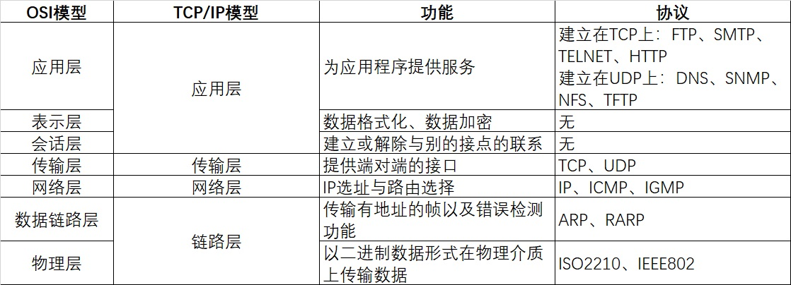

# 计算机网络

## TCP建立连接的三次握手过程以及断开连接的四次挥手过程

第一次握手：起初两端都处于CLOSED关闭状态，Client将标志位SYN置为1，随机产生一个值seq=x，并将该数据包发送给Server，Client进入SYN-SENT状态，等待Server确认；

第二次握手：Server收到数据包后由标志位SYN=1得知Client请求建立连接，Server将标志位SYN和ACK都置为1，ack=x+1，随机产生一个值seq=y，并将该数据包发送给Client以确认连接请求，Server进入SYN-RCVD状态，此时操作系统为该TCP连接分配TCP缓存和变量；

第三次握手：Client收到确认后，检查ack是否为x+1，ACK是否为1，如果正确则将标志位ACK置为1，ack=y+1，并且此时操作系统为该TCP连接分配TCP缓存和变量，并将该数据包发送给Server，Server检查ack是否为y+1，ACK是否为1，如果正确则连接建立成功，Client和Server进入ESTABLISHED状态，完成三次握手，随后Client和Server就可以开始传输数据。

第一次挥手：A数据传输完毕需要断开连接，A的应用进程向其TCP发出连接释放报文段（FIN = 1,序号seq = u）,并停止再发送数据，主动关闭TCP连接，进入FIN-WAIT-1状态，等待B的确认。

第二次挥手：B收到连接释放报文段后即发出确认报文段（ACK=1，确认号ack=u+1,序号seq=v）,B进入CLOSE-WAIT关闭等待状态,此时的TCP处于半关闭状态，A到B的连接释放。而A收到B的确认后，进入FIN-WAIT-2状态，等待B发出的连接释放报文段。

第三次挥手：当B数据传输完毕后，B发出连接释放报文段（FIN = 1，ACK = 1，序号seq = w,确认号ack=u+1）,B进入LAST-ACK（最后确认）状态，等待A 的最后确认。

第四次挥手：A收到B的连接释放报文段后，对此发出确认报文段（ACK = 1，seq=u+1，ack=w+1）,A进入TIME-WAIT（时间等待）状态。此时TCP未释放掉，需要经过时间等待计时器设置的时间2MSL后，A才进入CLOSE状态。

## TCP和UDP

1. TCP是面向连接的，udp是无连接的即发送数据前不需要先建立链接。
2. TCP提供可靠的服务。也就是说，通过TCP连接传送的数据，无差错，不丢失，不重复，且按序到达;UDP尽最大努力交付，即不保证可靠交付。 并且因为tcp可靠，面向连接，不会丢失数据因此适合大数据量的交换。
3. TCP是面向字节流，UDP面向报文，并且网络出现拥塞不会使得发送速率降低（因此会出现丢包，对实时的应用比如IP电话和视频会议等）。
4. TCP只能是1对1的，UDP支持1对1,1对多。
5. TCP的首部较大为20字节，而UDP只有8字节。

## CDN原理

CDN的全称是Content Delivery Network，即内容分发网络。CDN的基本原理是广泛采用各种缓存服务器，将这些缓存服务器分布到用户访问相对集中的地区或网络中，在用户访问网站时，利用全局负载技术将用户的访问指向距离最近的工作正常的缓存服务器上，由缓存服务器直接响应。

## 说一下用户从输入url到显示页面这个过程发生了什么

1. DNS解析
2. TCP连接
3. 发送HTTP请求
4. 服务器处理请求并返回HTTP报文
5. 浏览器解析渲染页面
6. 连接结束

## HTTP的头部包含哪些内容

HTTP的头域包括通用头、请求头、响应头和实体头四个部分。每个头域由一个域名，冒号（:）和域值三部分组成。

1. 通用头部是客户端和服务器都可以使用的头部，可以在客户端、服务器和其他应用程序之间提供一些非常有用的通用功能，如Date头部。
2. 请求头部是请求报文特有的，它们为服务器提供了一些额外信息，比如客户端希望接收什么类型的数据，如Accept头部。
3. 响应头部便于客户端提供信息，比如，客服端在与哪种类型的服务器进行交互，如Server头部。
4. 实体头部指的是用于应对实体主体部分的头部，比如，可以用实体头部来说明实体主体部分的数据类型，如Content-Type头部。

## 常见的HTTP请求方法

常见的请求方法有get,post，get用来请求数据，post用来提交数据，form表单使用get时数据会以querystring形式存在url中，因而不够安全也存在数据大小限制，而post不会，post将数据存放在http报文体中。所以获取数据时应该用get方法，提交数据用post方法。

### 请求方法head特性

Head只请求页面的首部，head方法和get方法相同，只不过服务器响应时不会返回消息体，一个head请求的响应中，http头中包含的元信息应该和一个get请求的响应消息相同，这种方法可以用来获取请求中隐含的元信息，而不用传输实体本身，这个也经常用来测试超链接的有效性和可用性。

Head请求有以下特点：

1. 只请求资源的首部，
2. 检查超链接的有效性
3. 检查网页是否被修改
4. 用于自动搜索机器人获取网页的标志信息，获取rss种子信息，或者传递安全认证信息等

## HTTP状态码；301和302有什么具体区别；200和304 的区别

状态码可以按照第一个数字分类，1表示信息，2表示成功，3表示重定向，4表示客户端错误，5表示服务器错误。

常见的状态码有101切换协议，200成功，301永久重定向，302临时重定向，304未修改。

301：永久移动，请求的网页已永久移动到新的位置，服务器返回此响应，会自动将请求者转到新位置。

302：历史移动，服务器目前从不同位置的网页响应请求，但请求者应继续使用原有位置来继续以后的请求。

200表示成功，服务器已成功处理了请求，通常表示为服务器提供了请求的网页。

304表示未修改，自从上次请求后，请求的网页未修改过，服务器返回此响应时不会返回网页内容。

## OSI模型

## HTTP缓存机制

HTTP缓存即是浏览器第一次想一个服务器发起HTTP请求后，服务器会返回请求的资源，并且在响应头中添加一些有关缓存的字段如：cache-control，expires,last-modifed，ETag,Date，等，之后浏览器再向该服务器请求资源就可以视情况使用强缓存和协商缓存，

强缓存：浏览器直接从本地缓存中获取数据，不与服务器进行交互。

协商缓存：浏览器发送请求到服务器，服务器判断是否可使用本地缓存。

